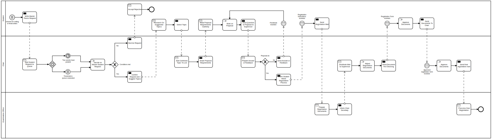
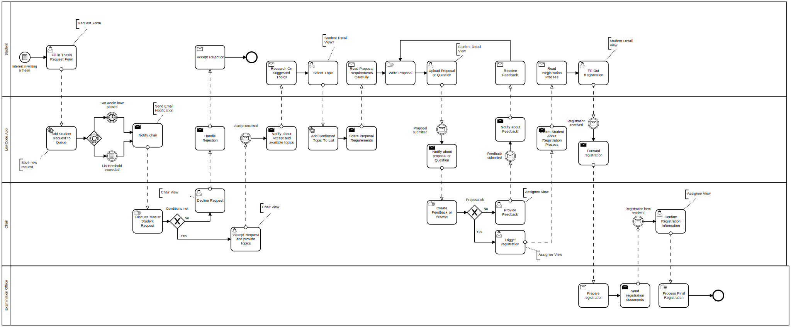
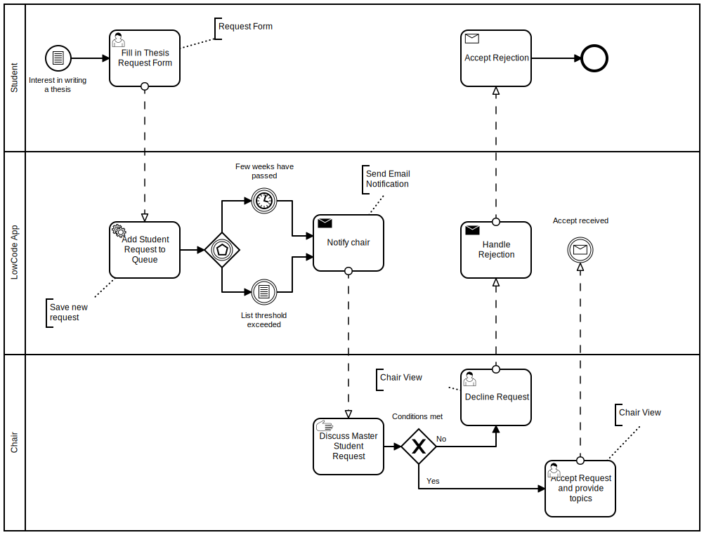

# Low-Code Investigation Use Case

This is the accompanying repository for the paper *A Use Case-based Investigation of Cloud-based Low-Code Development Platforms*.

In [process-models](process-models) you can find the modeled thesis registration process in its current state and the partly automated version.

Current manual process:

Envisioned partly automated process:

Excerpt considered in the implementation experiment:

